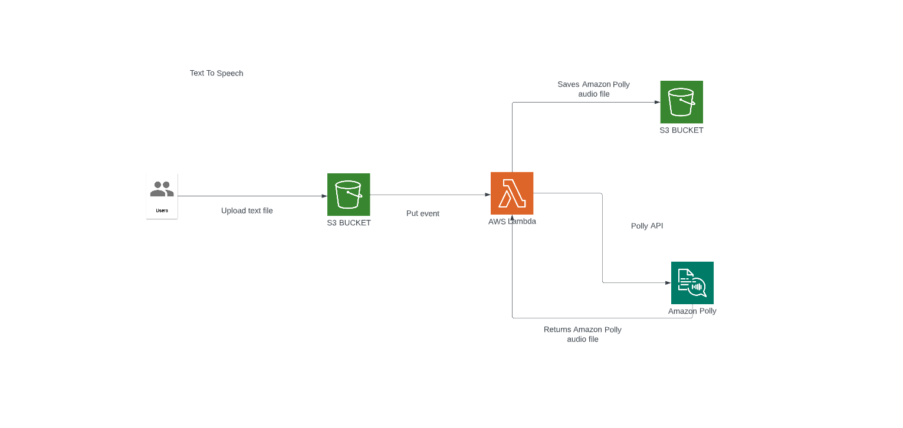

# Text-to-Speech Application on AWS

- This solution converts text into audio files by using Amazon Polly, an aws service that converts text into lifelike speech. 

- A user uploads a text file into the input folder of an Amazon Simple Storage Service (Amazon S3) bucket.

- The S3 bucket can be configured with S3 event notificaitons that invoke an AWS Lambda function whenever a text file is uploaded.

- The lambda function calls the Amazon Polly API to synthesize the provided text into a high-quality speech audio stream.

I will developing the project with @kerimdemirturk.In this project we are going to create a project in amazon polly.Project implementing converts text into audio files by using amazon polly.A user upload a text file into the s3 then we use s3 event notification for invoking a lambda function whenever a text file is uploaded.Lambda function calls the polly apı to provide text into a speech audio stream.Then polly process the request from lambda function and returns the audio file.Lambda function saves the audio file into the output folder of the s3 bucket.

